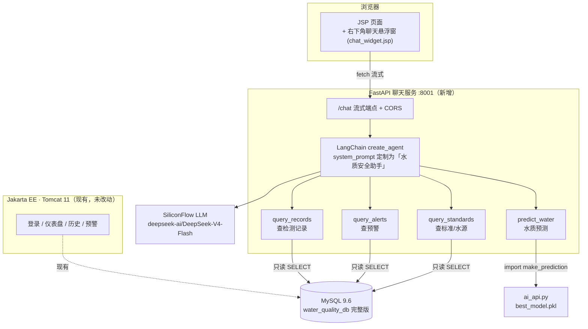

# 水质系统聊天智能体 · 说明文档

> 给「水质 AI 检测系统」新增的对话式智能助手：用自然语言**查检测记录、查预警、做水质预测、查国标限值**。
> 后端 LangChain Agent + FastAPI，前端 JSP 右下角悬浮窗，全站页面自动可用，不动任何 Java 后端。

版本：1.0.0 ｜ 分支：`feature-chat-agent` ｜ 端口：8001

---

## 一、架构总览



**设计要点**：聊天服务与原预测服务（ai_api.py :8000）同进程复用 `make_prediction`，避免重复加载模型；工具层只做只读参数化查询，LLM 不直接执行 SQL；前端纯 JS fetch 流式渲染，零侵入 Jakarta EE。

---

## 二、核心组件

| 文件 | 层 | 职责 |
|---|---|---|
| `WaterQualityAI/chat_config.py` | 配置 | DB 连接 + LLM（SiliconFlow/DeepSeek）+ 端口 + 指标别名表 |
| `WaterQualityAI/chat_tools.py` | 工具 | 4 个 LangChain Tool，pymysql 只读 + 参数化查询 |
| `WaterQualityAI/chat_agent.py` | 智能体 | `create_agent` + `astream_events(v2)` 流式，按模型缓存 |
| `WaterQualityAI/chat_main.py` | 服务 | FastAPI 8001，`/chat` 流式 + `/tools` + CORS |
| `WaterQualitySystem/.../chat_widget.jsp` | 前端 | 右下角悬浮窗（气泡+面板+流式打字机+快捷问题） |
| `template_header.jsp` | 接入 | `</nav>` 后一行 `<%@ include %>`，全站自动有悬浮窗 |

---

## 三、工具清单

| 工具 | 作用 | 触发示例 | 数据源 |
|---|---|---|---|
| `query_records` | 查历史检测记录，支持按合格/不合格过滤 | "最近有哪些检测记录"、"有哪些不合格水样" | `water_detection` + `users` + `water_source_info` |
| `query_alerts` | 查预警日志，支持只看未处理 | "有哪些未处理的预警" | `warning_log` + `water_detection` |
| `predict_water` | 9 项指标做 AI 预测（安全/概率/等级/WQI） | "预测 ph=7.2 硬度150 浊度2.3 ..." | `best_model.pkl`（VotingEnsemble） |
| `query_standards` | 查国标限值 / 水源信息 | "饮用水 pH 标准范围"、"有哪些采样水源" | `water_standard` / `water_source_info` |

**predict_water 的 9 项指标**：pH、硬度、固体、氯胺、硫酸盐、电导率、有机碳、三卤甲烷、浊度（中英文别名都能识别）。

---

## 四、API 端点

| 方法 | 路径 | 说明 |
|---|---|---|
| GET | `/` | 健康检查，返回服务状态 + 模型 + 工具列表 |
| GET | `/tools` | 列出 4 个工具的名称和描述 |
| POST | `/chat` | **流式聊天**，返回 `text/plain` 流，逐段输出 |

`/chat` 请求体：
```json
{
  "query": "最近有哪些检测记录？",
  "history": [{"role": "user", "content": "..."}, {"role": "assistant", "content": "..."}],
  "model": null
}
```
`history` 可选（前端只带最近 10 轮，避免上下文过长）；`model` 不传用默认 DeepSeek。

---

## 五、启动方式

### 1. 准备数据库（一次性）

本地 `water_quality_db` 需为 GitHub 完整版（含 `water_source_info` 表等）。
若本地是早期简化版，用 `mysql/water_quality_db.sql` 重建：

```bash
# 用 mysql 客户端（处理 DELIMITER 存储过程）
mysql -uroot -p123456ccm water_quality_db < mysql/water_quality_db.sql
```

验证：`SHOW TABLES` 应有 16 个表，`water_source_info` 有 5 条水源数据。

### 2. 安装依赖

```bash
cd WaterQualityAI
pip install -r requirements.txt   # 含 langchain / pymysql / sklearn / lightgbm 等
```

### 3. 启动聊天服务（密码走环境变量，不进代码）

```bash
cd C:\Users\31290\PycharmProjects\water-quality-system\WaterQualityAI
WQ_DB_PASSWORD=你的密码 python chat_main.py
```

> **安全提示**：MySQL 密码用环境变量 `WQ_DB_PASSWORD` 传入，**不要**写进 `chat_config.py`——本仓库会推送到 GitHub，明文密码会泄露。

启动后访问 `http://127.0.0.1:8001/docs` 看 Swagger。

### 4. 启动 Web 前端（Tomcat）

```bash
cd WaterQualitySystem
mvn package
# 把 target/*.war 部署到 Tomcat webapps/，重启 Tomcat
```

打开任意页面，**右下角出现聊天气泡**，点击展开即可对话。

---

## 六、实测示例（真实输出摘录）

### ① 查检测记录 → `query_records`

**问**：最近有哪些水质检测记录？

**答**（摘录）：查到 7 条，整理成表格（ID/检测时间/pH/硬度/浊度/预测/概率），并分析：
- 合格 4 条，#7 安全概率最高 92%
- 不合格 3 条集中在 05-13~05-14，#18 浊度 10.0 多项超标
- 主动建议："需要我进一步查看这几条 Bad 记录的预警日志吗？"

### ② 查预警 → `query_alerts`

**问**：有哪些未处理的预警？

**答**：2 条未处理预警（#14 高危 p=0.25 关联检测#19、#15 中危 p=0.50 关联#20），表格 + 解读 + 建议复核。

### ③ 查国标 → `query_standards`

**问**：饮用水各项指标的标准范围是多少？

**答**：9 项指标表格（pH 6.5~8.5、硬度<450、浊度<5...含单位和 GB5749-2022），说明 pH 是区间标准其余上限型，并建议做预测。

### ④ 水质预测 → `predict_water`

**问**：帮我预测 ph=7.2, 硬度=150, 固体=320, 氯胺=2.1, 硫酸盐=180, 电导率=450, 有机碳=1.2, 三卤甲烷=25, 浊度=2.3

**答**：
| 项目 | 结果 |
|---|---|
| 安全判定 | Safe，概率 53.93% |
| 水质等级 | Poor（较差） |
| WQI 指数 | 75.27 |
| 对应标准 | 地表水 II 类 |
| 模型 | VotingEnsemble |

通俗解读："概率只有 53.93%，刚过 0.5 阈值，属于勉强安全、临界地带"，建议复测浊度/氯胺/三卤甲烷，并主动提议查对应国标限值。

---

## 七、数据库结构（完整版）

重建后的 `water_quality_db` 含 16 个对象：

| 类型 | 对象 |
|---|---|
| 业务表 | `roles` `users` `water_source_info` `water_standard` `water_detection` `warning_log` `detection_history` `system_log` `ai_model_info` `announcement` `feedback` `standard_change_log` |
| 视图 | `v_safe_water` `v_detection_summary` `v_high_risk_waters` `v_user_detection_stats` |
| 存储过程 | `generate_daily_report` `process_high_risk_warnings` `sp_monthly_report` `sp_user_activity_analysis` |
| 函数 | `classify_water_quality` `calculate_wqi` |
| 触发器 | `trg_insert_warning` `trg_detection_update_history` `trg_standard_update_log` `trg_warning_resolved_log` |

---

## 八、答辩亮点

1. **AI 引论 + 数据库原理 双课程融合**：Agent 调工具查库（数据库原理：参数化查询/外键/视图/触发器），LLM 推理预测（AI 引论：集成学习模型 + 安全门领域知识）。
2. **零侵入集成**：JSP 一行 include 全站有悬浮窗，不动任何 Servlet/DAO。
3. **流式体验**：`astream_events` + `fetch reader` 打字机效果，即时反馈。
4. **安全边界**：工具只读、参数化查询、密码走环境变量不进 git、模型 import 失败优雅降级。
5. **完整业务闭环**：查记录→查预警→预测→查国标，覆盖水质管理全流程。

---

## 九、已知限制

- `predict_water` 依赖 `sklearn/lightgbm/xgboost`，未装时工具返回友好降级提示，不影响其他工具。
- `.pkl` 用 scikit-learn 1.8.0 训练，1.9.0 加载有 `InconsistentVersionWarning`，结果正确。
- LLM（SiliconFlow）偶发连接抖动，重试即恢复。
- 历史上下文前端只带最近 10 轮，超长对话会截断。
